Lightsail incluye todo lo que necesitas para desplegar tu proyecto rápidamente – una máquina virtual, almacenamiento basado en SSD, transferencia de datos, manejo de DNS e IP estática – por un precio bajo y predecible.

Amazon Lightsail es la forma más fácil de comenzar con Amazon Web Services (AWS) si sólo necesitas un servidor virtual privado. Lightsail incluye todo lo que necesitas para desplegar tu proyecto rápidamente – una máquina virtual, almacenamiento basado en SSD, transferencia de datos, manejo de DNS e IP estática – por un precio bajo y predecible.

Este tutorial te muestra cómo puedes lanzar y configurar WordPress en Lightsail.

Incluye todos los pasos necesarios para conectarte a tu instancia utilizando SSH, acceder a tu sitio web, crear una IP estática y adjuntarla a tu instancia, además, crear una zona DNS y mapearla a tu dominio.

Cuando termines este tutorial, vas a contar con los fundamentos para lanzar a producción tu sitio de WordPress en Lightsail de Amazon Web Services.

Estos pasos son cubiertos en las siguientes secciones de este tutorial:

1. Registrarse en AWS.

1. Crear una instancia de WordPress en Lightsail.

1. Conectar tu instancia via SSH y obtener la contraseña para tu sitio web.

1. Acceder al tablero de administración en tu sitio web de WordPress.

1. Crear una dirección IP estática de Lightsail y adjuntarla a tu sitio web.

1. Crear una zona de DNS y mapearla a tu dominio.

## Paso 1: Registrarse en AWS
Es indispensable que tengas una cuenta de Amazon Web Services (AWS), para crearla puedes hacer clic aquí o accede a tu cuenta si ya la tienes haciendo clic acá.

##  Paso 2: Crear una instancia de WordPress en Lightsail
En este paso te voy a mostar cómo instalar WordPress en una instancia de Lightsail.

* Acceder a la consola.
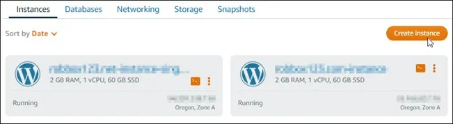
* En la pestaña de instancias de la home de Lightsail, elige crear instancia.
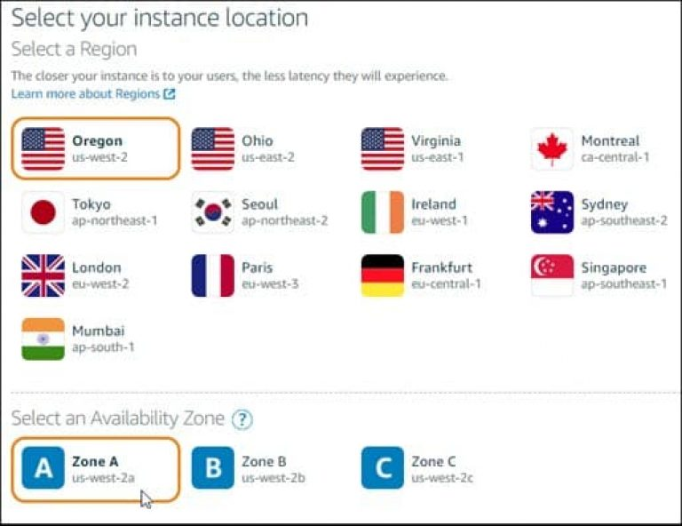
* Elige la región y la zona de disponibilidad de tu instancia. Para latino américa recomiendo la de región de Virginia porque parece estar más cerca, pero no creo que se note mucha diferencia, y respecto a la zona de disponibilidad, cualquiera que selecciones está bien.
  
* Elige una imagen para tu instancia:
    - Selecciona Linux/Unix como plataforma.
    - Elige WordPress como plantilla.
* Choose your instance image.
    * Choose Linux/Unix as the platform.
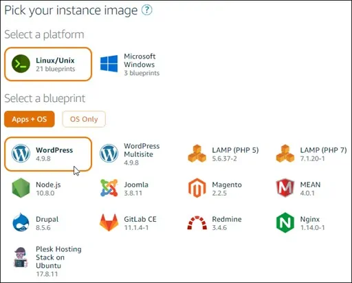
* Elige WordPress como el blueprint:
    * Elige un plan para la instancia: yo te recomiendo comenzar con el más económico, el de $3.50 USD mensuales (un mes gratis), a no ser que esperes tener muchísimo tráfico o sea un e-commerce, ya que para eso vas a necesitar más recursos.
 
        ¿No sabes bien qué elegir? Te invito a que me escribas por el chat en vivo y te ayudaré en lo que pueda.
* Dale un nombre a tu instancia.
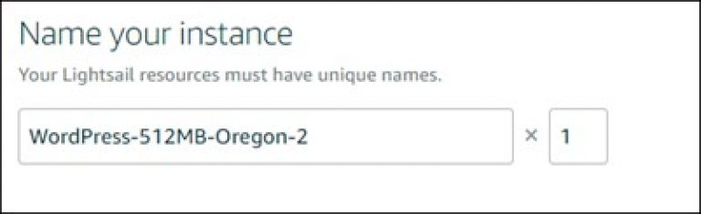
* En la parte de etiquetas / tags puedes poner lo que quieras.
* Cliquea en crear instancia. ¡Listo!

## Paso 3: Conectar tu instancia via SSH y obtener la contraseña para tu sitio web.
La contraseña por defecto para acceder a tu sitio web de WordPress está almacenada en tu instancia.

La puedes recuperar al conectarte utilizando la terminal SSH en la consola de Lightsail e introducioendo un comando especial.
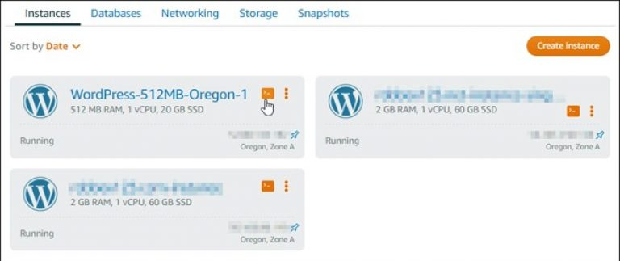

* En la pestaña de instancias de la home, selecciona el ícono de SSH quick-connect de tu instancia de WordPress:

* Después de que se abra la terminal, introduce el siguiente comando para recuperar la contraseña de la aplicación:

`cat bitnami_application_password`

### NOTA:
Si estás en otro directorio que no sea la home, entonces introduce lo siguiente:

`cat $HOME/bitnami_application_password.`

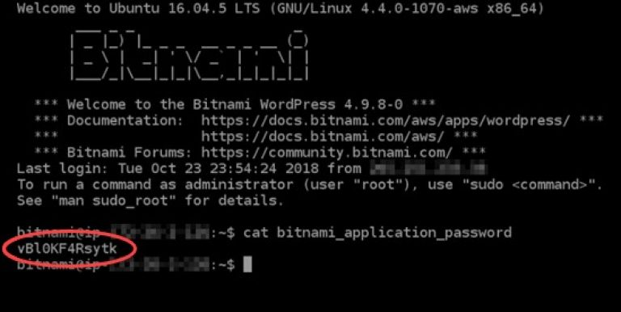

* Guarda la contraseña mostrada en la pantalla, ya que la vas a utilizar después para acceder a el área de administración de WordPress.

## Paso 4: Acceder al tablero de administración en tu sitio web de WordPress

Ahora que tienes la contraseña de WordPress, ya puedes acceder.

Puedes cambiar la contraseña, instalar plugins, cambiar el tema de tu sitio y mucho más.

Estos son los pasos para acceder:

* En un navegador (Chrome, Safari, Firefox, etc.) ve a:

    `http://<dirección IP plublica>/wp-login.php`

    Asegurate de reemplazar **<dirección IP pública>** con la de tu instancia de WordPress.

* En el campo de usuario o email, introduce user.
* En el campo de contraseña, introduce la que obtuviste en el paso anterior.
* Cliquea en login para acceder.

Ahora estás loggeado en el panel administrativo de tu sitio de WordPress.

Deberías ver algo así:

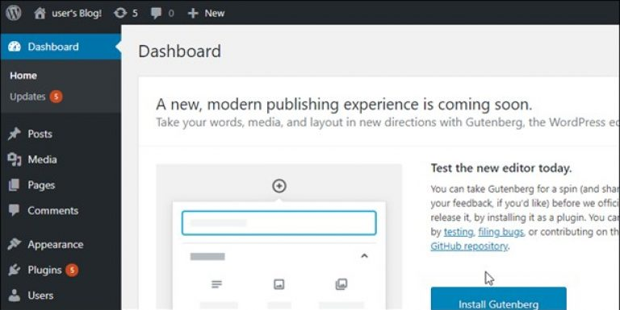

## Paso 5: Crear una dirección IP estática de Lightsail y adjuntarla a tu sitio web.

La IP pública de tu instancia de WordPress cambia si detienes y reinicias la instancia.

Una dirección de IP estática, adjunta a tu instancia, se mantiene igual incluso si la detienes y reinicias.

Crea una IP estática y adjuntala a tu instancia de WordPress:

* En la pestaña de instancias de la home, elige la que corre tu sitio web de WordPress:
    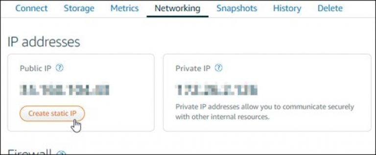
    
* Cliquea la pestaña de Networking, y elige Crear IP estática:
    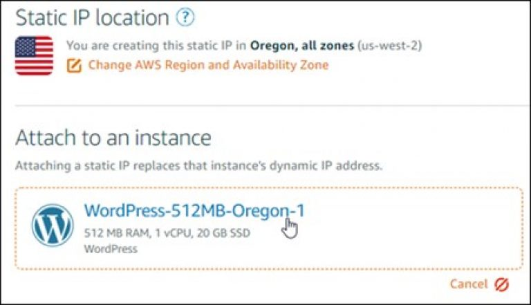
    
* La locación de la IP estática, y la instancia adjunta son pre-seleccionadas en base a la instancia que elegiste al inicio del tutorial.
* Dale un nombre a tu IP estática, y haz clic en Crear.

## Paso 6: Crear una zona de DNS y mapearla a tu dominio

Transfiere el manejo del DNS de tus dominios a Lightsail, ya que esto te permite mapear un dominio a tu instancia de WordPress de una manera más fácil, además, te permite manejar todos los recursos de tu sitio web desde la consola de Lightsail. Todo en un solo lugar.

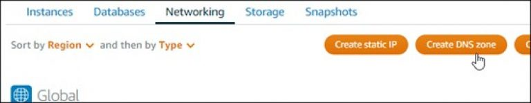

* En la pestaña de Networking de la home, elige Crear zona de DNS.
    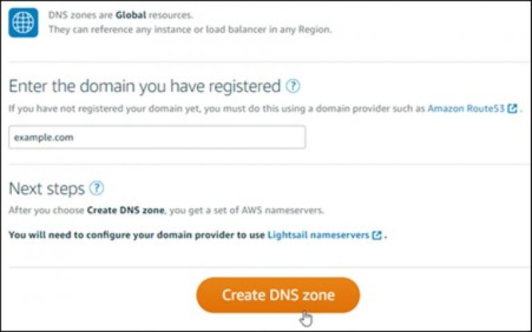
    
* Ingresa tu dominio, y elige Crear Zona de DNS.
* Guarda las direcciones de los Nameservers que se muestran en la página:
    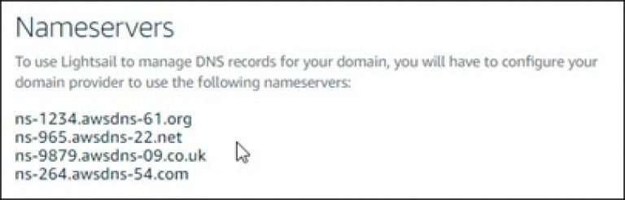
    
* Añade estos nameservers en la configuración de dominio de la plataforma donde lo compraste. Esto va a transferir el manejo del DNS a Lightsail.
* Después de que haz transferido el manejo del DNS de tu dominio a Lightsail, añade un A record para apuntar el dominio a tu instancia de WordPress, de esta forma:
    * En la zona DNS de tu dominio, cliquea en Añadir Record.
    * En el campo de Subdominio, ingresa el símbolo de @ para mapear el ápex de tu dominio (ejemplo.com) con tu instancia. El @ simboliza explícitamente que estás añadiendo un A record. No es añadido como un subdominio.
    * En el campo de Mapas, elige la IP estática que adjuntaste a la instancia de WordPress en los pasos anteriores de este tutorial.
    * Cliquea el ícono de guardar (chulito verde).
    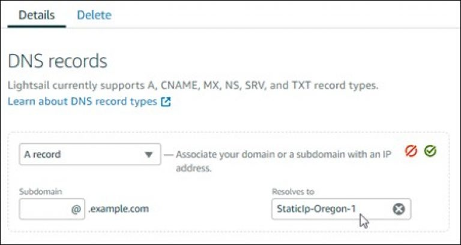
    * Dale tiempo para que se propage el cambio a través del DNS de la internet, ya que antes de esto no vas a poder acceder a tu sitio mediante el dominio. Esto puede tomar desde 15 minutos hasta 24 horas.
    
## Próximos pasos